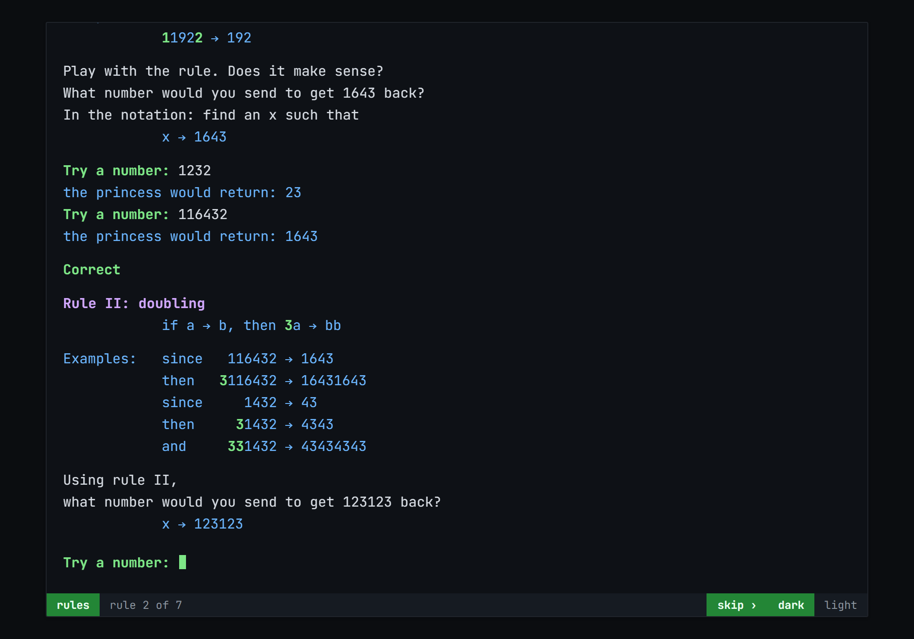

# the_princess_test

**[▶ Run it](https://boris-volkov.github.io/the_princess_test/)**



Here is a logic puzzle that I found in a book and decided to write a program around. You start by learning the rules to a particular number game, and then attempt to pass the SIX TESTS. You play by just typing your answers into the interactive terminal. There is no penalty for wrong guesses.

This puzzle is rather hard, so be prepared to take a few hours, at least.

---

## How it is built

The terminal is the same one the [landing page](https://github.com/boris-volkov/boris-volkov.github.io)
runs on, and it is not an emulator. There is no library and no build
step — five files, served as they are:

| file | what it is |
|---|---|
| `terminal.js` | the terminal: a scrollback of DOM rows, and one invisible `<input>` |
| `princess.js` | the princess — the one function that answers a number |
| `rules.js` | learning the rules (`index.html`) |
| `tests.js` | the six tests (`princess.html`) |
| `style.css` | the chrome, and both colour themes |

The trick is the `<input>`. It sits at `opacity: 0` over the styled
prompt text, so the browser goes on handling the mobile keyboard, the
IME, backspace, paste, select and the arrow keys, and the spans behind
it do the colouring that no single input could. A terminal emulator
hands you a grid of character cells and leaves every one of those as
your problem.

## Writing content

Text is written plainly. A **role** colours a block, and **`backticks`**
colour a run inside one:

```js
head("Rule II: doubling"),
note("            if a → b, then `3`a → bb"),
body("What number would you send to get 123123 back?")
```

The roles are `head` (a rule's name), `body` (prose), `note` (notation
and worked examples), `aside` (instructions about the program), `good`
and `warn`. Every colour is a CSS custom property named for its role,
so both themes are one variable each and nothing repaints twice.

## Things that will bite you

**The theme key is shared.** `bv-theme` in localStorage is the landing
page's key, read before first paint so arriving from there never
flashes the other look. Renaming it here breaks that, silently.

**Rows are `pre-wrap`, not `pre`.** The indentation in the rules is
literal spaces and has to survive, but a line too long for a phone
should fold rather than push the terminal sideways. Content is written
to about 60 columns.

**`princess.js` is loaded by both pages.** It is the puzzle itself;
keep it free of anything to do with either page.

## Trying it before you push

```bash
python -m http.server 8000
```

Then open <http://localhost:8000/>. That is the whole toolchain.
